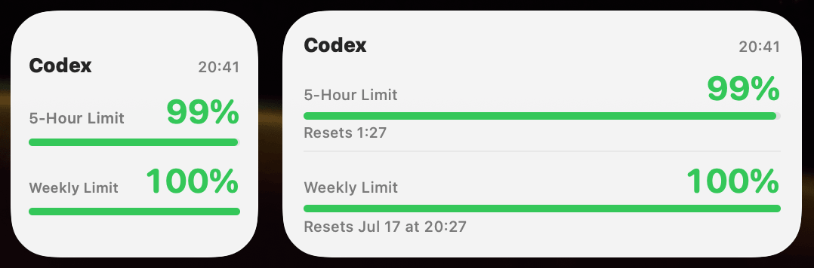

# CodexLimits

CodexLimits is a minimal macOS menu bar app for monitoring ChatGPT Codex usage.

## Features

- Displays the 5-hour and weekly usage percentages in the menu bar.
- Colors each percentage green, orange, or red based on usage.
- Refreshes every 1, 2, 3, or 5 minutes.
- Includes a small and medium WidgetKit widget.
- Uses an embedded ChatGPT web view for authentication.
- Shares snapshots with the widget through an App Group.
- Preserves the existing macOS localizations.

## Build

Open `CodexLimits.xcodeproj`, select your Apple Developer team, register the App Group for both targets, and build the `CodexLimits` scheme.

The app reads Codex usage from `https://chatgpt.com/backend-api/wham/usage` using the authenticated embedded web session.

## License

CodexLimits is available under the [MIT License](LICENSE).
