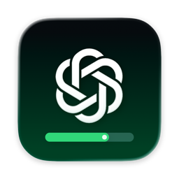
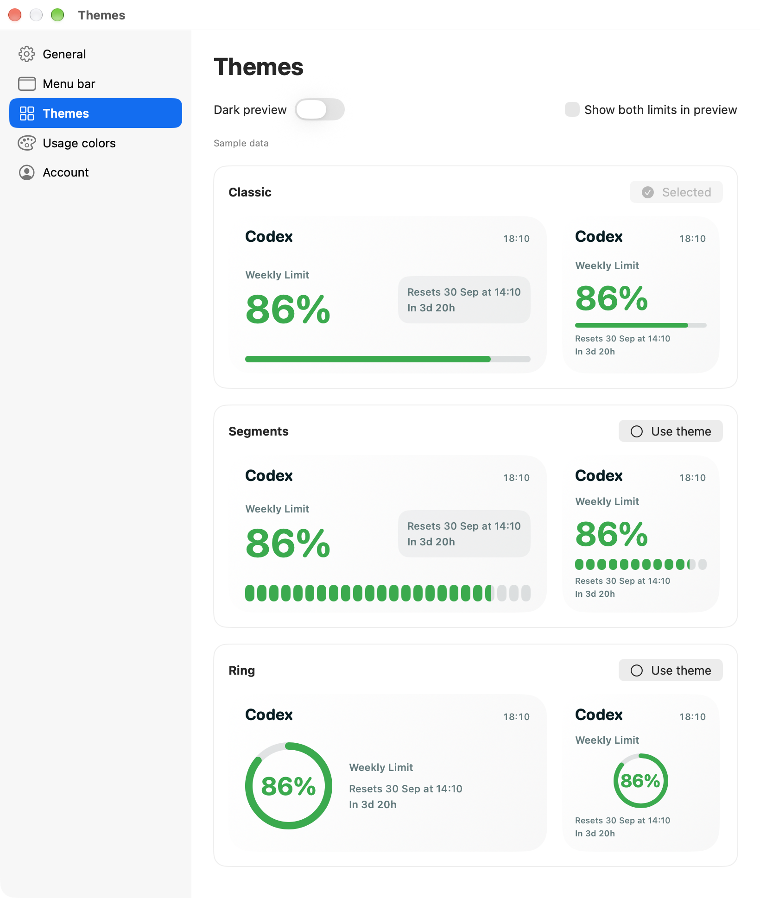

<p align="center">
  
</p>
<h1 align="center">CodexLimits</h1>
<p align="center">Your remaining ChatGPT Codex usage, at a glance.<br>A native macOS menu bar app with desktop widgets.</p>

<p align="center">
  <a href="https://github.com/Anywhere-Music-Player/CodexLimits/releases/latest"></a>
  
  
  <a href="LICENSE"></a>
</p>
<p align="center">
  <a href="#quick-start">Build &amp; install</a> ·
  <a href="#development">Development</a> ·
  <a href="https://github.com/Anywhere-Music-Player/CodexLimits/releases">Releases</a> ·
  <a href="https://github.com/Anywhere-Music-Player/CodexLimits/issues">Report an issue</a>
</p>

## At a glance

| Feature | What you get |
| --- | --- |
| Menu bar | Remaining percentages, compact progress meters, or both, with an immediate settings preview. |
| Adaptive limits | Shows the available 5-hour and weekly limits; weekly-only accounts have no empty 5-hour placeholder. |
| Desktop widgets | Small and medium widgets in Classic, Segments, and Ring themes. |
| Reset tracking | Reset dates and localized countdowns, without a redundant remaining label. |
| Personalization | Usage colors and sidebar settings with theme previews in both sizes and appearances. |
| Refresh | Choose an interval of 1, 2, 3, or 5 minutes. |
| Sign-in | Authenticate through an embedded ChatGPT web view. |

## Settings & widget themes

<p align="center">
  
</p>
<p align="center"><sub>Theme previews use sample data. Actual limits depend on your account.</sub></p>

## Quick start

Download the source archive from the [latest release](https://github.com/Anywhere-Music-Player/CodexLimits/releases/latest), or clone the repository below. Releases currently provide source code; build the app with Xcode on macOS:

```sh
git clone https://github.com/Anywhere-Music-Player/CodexLimits.git
cd CodexLimits
open CodexLimits.xcodeproj
```

1. Select your Apple Developer team for the app and widget targets.
2. Register and enable the App Group `group.com.buildsucceeded.codex-limits` for both targets.
3. Select the **CodexLimits** scheme and your Mac as the destination, then build and run.
4. Open **Settings → Account** from the menu bar and sign in through the embedded ChatGPT page.
5. Choose your refresh interval and menu bar display. To use a widget, open macOS **Edit Widgets**, find **CodexLimits**, and add a small or medium widget.

For example, enable percentages and progress meters to keep remaining usage visible while you work, then choose a widget theme under **Settings → Themes**.

The targets use Xcode's recommended macOS deployment target. Check the resolved deployment target in Xcode for the version you are building.

## Development

| Directory | Purpose |
| --- | --- |
| `CodexLimits/` | App entry point, menu bar, settings, web login, and usage fetcher. |
| `CodexLimitsShared/` | Shared models, snapshot storage, refresh settings, and widget presentation. |
| `CodexLimitsWidget/` | WidgetKit extension. |
| `Tests/` | Presentation and usage-model checks. |

### Data flow

The app reads Codex usage from `https://chatgpt.com/backend-api/wham/usage` using the authenticated embedded web session. It saves `usage_snapshot.json` in the App Group container so the widget can read the latest snapshot. The menu bar uses live app state.

The widget provides minute-spaced countdown entries for one hour between timeline reloads. WidgetKit controls actual delivery and may defer updates.

### Presentation checks

Run the checks on macOS with Xcode installed:

```sh
Scripts/check-presentation.sh
```

They cover weekly-only parsing, menu-bar display modes, reset boundaries, and compatibility with saved themes.

To also render native settings and widget states without opening the app or starting account requests:

```sh
CODEX_LIMITS_RENDER_DIR=/tmp/codexlimits-previews Scripts/check-presentation.sh
```

## Contributing

Bug reports and focused pull requests are welcome. Include your macOS and Xcode versions, reproduction steps, and screenshots where helpful in an [issue](https://github.com/Anywhere-Music-Player/CodexLimits/issues).

Read [the contributor notes](AGENTS.md) before making changes. Keep the app Codex-only, preserve the supported localizations, add new UI strings to every supported localization, and keep refresh choices limited to 1, 2, 3, and 5 minutes. Source code and documentation are maintained in English.

## License

CodexLimits is available under the [MIT License](LICENSE).
