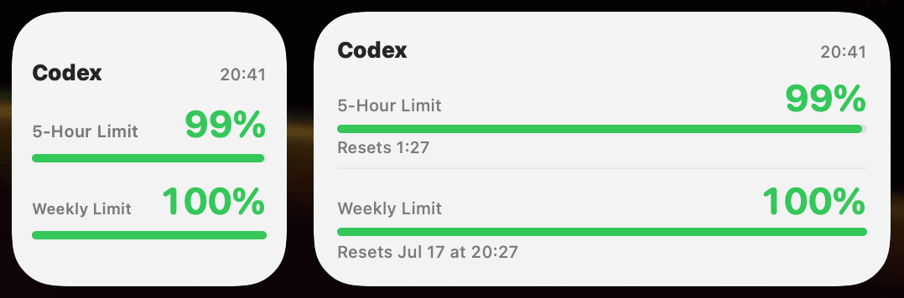

# CodexLimits

CodexLimits is a minimal macOS menu bar app for monitoring ChatGPT Codex usage.



## Features

- Displays available usage limits in the menu bar; weekly-only accounts do not show an empty 5-hour limit.
- Lets you independently show percentages and compact progress meters, with an immediate settings preview.
- Colors each percentage green, orange, or red based on usage.
- Refreshes every 1, 2, 3, or 5 minutes.
- Includes small and medium widgets with Classic, Segments, and Ring themes.
- Shows the reset date and a localized countdown without a redundant remaining label.
- Organizes settings in a sidebar with theme previews in both sizes and appearances.
- Uses an embedded ChatGPT web view for authentication.
- Shares snapshots with the widget through an App Group.
- Preserves the existing macOS localizations.

## Build

Open `CodexLimits.xcodeproj`, select your Apple Developer team, register the App Group for both targets, and build the `CodexLimits` scheme.

The app reads Codex usage from `https://chatgpt.com/backend-api/wham/usage` using the authenticated embedded web session.

## Presentation checks

Run `Scripts/check-presentation.sh` on macOS with Xcode installed to check weekly-only parsing, menu-bar display modes, reset boundaries, and compatibility with saved themes.

To also render the native settings and widget states without opening the app or starting account requests:

```sh
CODEX_LIMITS_RENDER_DIR=/tmp/codexlimits-previews Scripts/check-presentation.sh
```

The widget provides minute-spaced countdown entries for one hour between timeline reloads. WidgetKit controls actual delivery and may defer updates.

## License

CodexLimits is available under the [MIT License](LICENSE).
